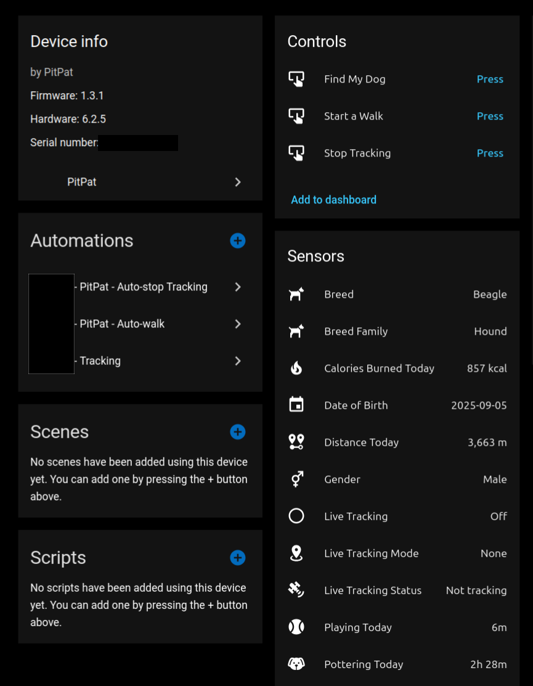
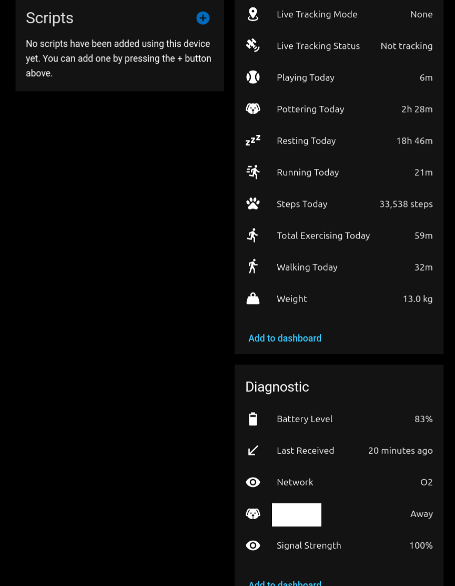

# Home Assistant PitPat Integration

This is a custom integration for Home Assistant to add support for the PitPat GPS tracker.

This is in no way endorsed or affiliated with PitPat.

> :warning: This integration is very experimental.
>
> - Expect bugs caused by limited testing causing unreliable or incorrect data (I only have access to a single device of one type)
> - Expect potentially breaking changes requiring you to re-write scripts and automations
> - Be prepared for a not very user-friendly setup. It’s gets quite technical.
> - Don’t expect support or quick fixes
> - A PitPat subscription isn’t required for any of the integration functionality. The integration in some ways is replicating some of the functionality of the pitpat subscription model. Expect it to disappear swiftly if PitPat decide they don’t like this being available and take action.

Some sensors may not be available for your device type. I only have a single GPS device tracker for testing.

## Setup

1. Add this as a custom repository via HACS
1. Install the integration:

    

1. Add the integration:

    

When setting up the integration, you will be asked for an auth token and user Id. Currently, these must be obtained by inspecting traffic from the app.

For Android:

1. Download the Pitpat app, and login
1. Download [PCAP Android](https://github.com/emanuele-f/PCAPdroid) app, and configure it for [TLS decryption](https://emanuele-f.github.io/PCAPdroid/tls_decryption)
1. Configure PCAP android to only monitor the Pitpat app
1. Start a capture in PCAP, then open the Pitpat app. The app is very chatty so you only have to open it and PCAP should capture a lot of requests with the required information.
1. Stop the capture and go to the connections tab. Open any of the HTTPS request EXCEPT for `handler.pitpat.com`.
1. Grab the auth token from the request. It will be in the format `Authorization: Bearer <token>`
1. Grab the user Id from the request. It will be on the first line in the url, usually as: `.../Users/<user-id>/Dogs/...`

I'm unable to provide instructions for iOS devices.

> :warning: It is not currently known how long the auth token will last, or if it will remain active indefinitely. The only way currently to update the auth token is to remove and re-add the integration.

## Options

By default the integration polls for updates every 5 minutes. This can be increased in the options panel:

1. Go to the integration page:

    

1. Click the options cog for the entry.
1. Adjust the poll interval as required and save.

The new interval should take effect without needing to reload anything.

## Troubleshooting

As mentioned, this is highly experiment, and is a small hobby project. If you run into issues, please check the logs and try to diagnose the issue yourself. If you need to raise an issue, please include logs.

## How can I help?

- If your PCAP capture manages to decrypt the `auth.pitpat.com` requests, I would be very interested in seeing them (obviously with sensitive parts redacted).
- Any other investigation into workings of the APIs.
- Investigating any issues you encounter. My testing is fairly limited due to time and only having a single device.
- Reporting issues including any logs.
- Investigating any issues others post.

## Can I fork this?

Sure. I would just ask that you:

- Consider submitting your work as a pull request first,
- If you plan to fork this permanently, include a note to credit my work, and anyone else who has contributed.
